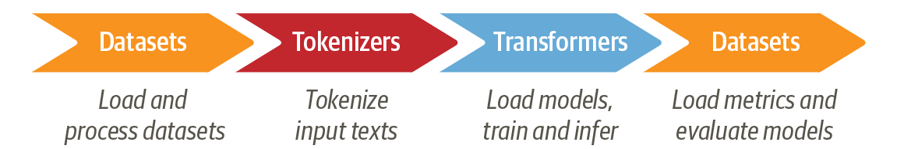
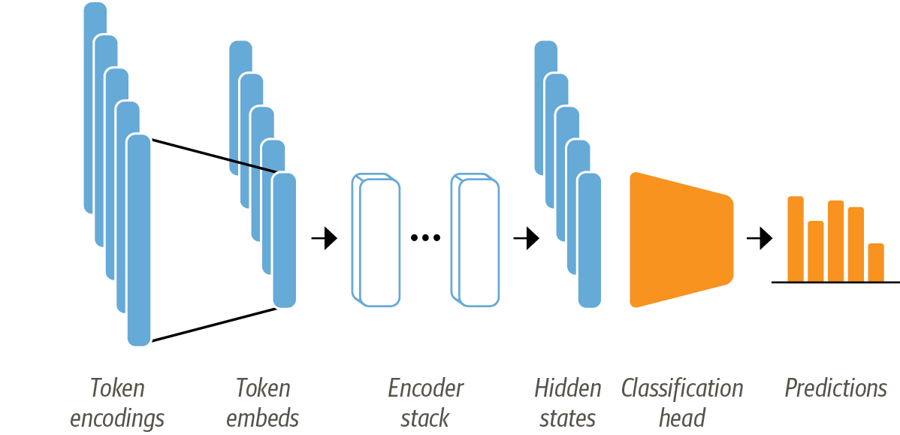
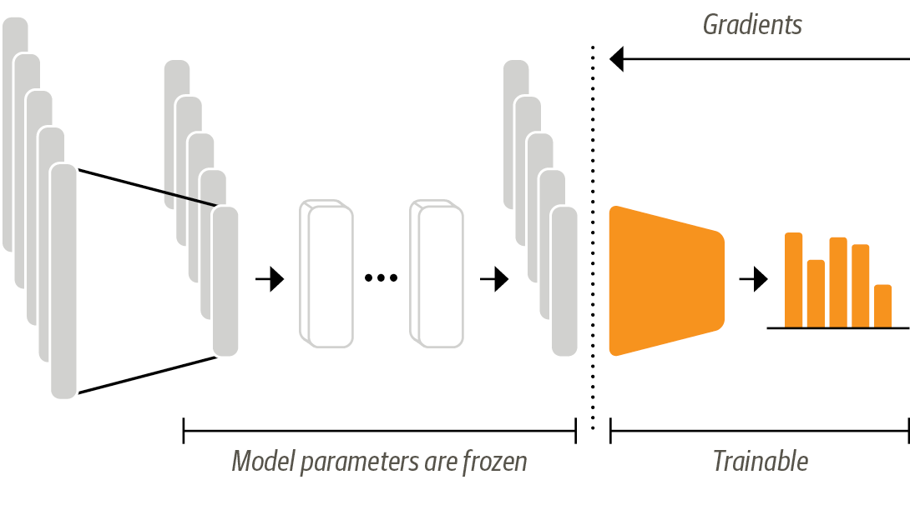
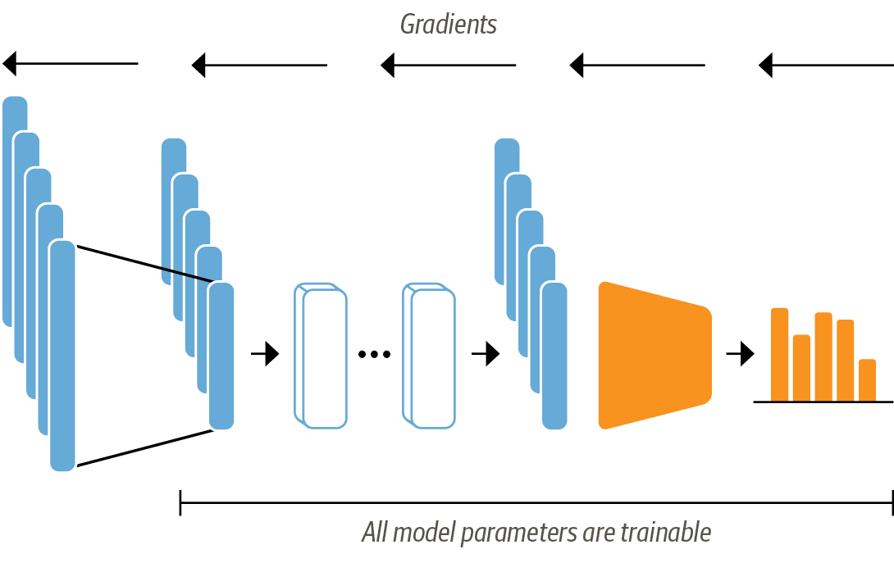

# 今日はみなさんにTarnsformersでBERTを用いたテキスト分類モデルを作れるようになってもらいます

 * GPUをマザボに刺したりnvidiaのドライバをセットするなどの環境整備されていることを前提とします

----
# サマリー（今日はこれだけ覚えて帰ろう）
 * 図2-2 
 * 事前学習言語モデルを用いたテキスト分類のイロハ
   * 事前モデルのデータロード 
   * 自分のタスクの学習データの準備
   * 学習と評価

の手順を覚える

-----
# 目次

 * Transformersでするテキスト分類の特徴の説明
 * Transformersのデータセットを見てみましょう
 * tokenize
 * データの
 * 学習
 * 評価
 * 日本語だとどうなる？
 * ディスカッション
 * よくある質問

-----
# テキスト分類タスクの概要（1/2）

 * Input：テキスト → （分類モデル）→ Output:クラスラベル
 * 出力ラベルのいろいろ
   * 2値(binary class)分類、多値（muli class）分類
     * 入力テキストがどのクラスかを排他的に分類
     * 例）レビューを「真 or 偽」「松 or 竹 or 梅」(品質)に分類
   * 多ラベル（multi label)
     * 入力テキストの分類が複数重複してもOK。タグつけ
     * 例）新聞記事を「政治」「総理大臣」「農業」などでラベル付
       * 実装例）分類ラベルごとの確信度が閾値以上のものをタグつけ

-----
# テキスト分類の概要（手法の別）
 * ルールベース（キーワードやif文で行う）手法
 * 機械学習モデル（svm、Logistic Regression、Naive Bayes、Decision Tree、lightgbm、XGBoost、DNN…）
   * 学習データ（テキストと正解ラベル）を用いてモデルのパラメータを決める（重み、パラメータ、決定木の形など）

  * （今日の話）DNN系列のTransformerベースのテキスト分類
    1. 事前学習言語モデル：事前に大規模テキストで別タスク（穴埋めとか次の文予測とか）のニューラルネットワークを学習済 (出汁)
    2. fine-tuning: ユーザは個別の分類タスク用のネットワークを追加し、個別の学習データで学習（fine-tuning）を行う（みそ） 
-------
# Transformers ２章 の テキスト分類

 * サンプルタスクとして以下に取り組む
   * クラスの数は？　multi-class classification
   * データは？　emotion データ
     * sentiment analysis
     * テキストの感情分類。怒ってる？　喜んでる？
      * 補足）極性分類（polarity analysis)という言葉もある。ポジネガ
      * 応用）Voice of customer (VOC) の 分析
   * モデル：DistliBERT
     * 言語は英語
     * 蒸留を使って軽くしたBERT
      　* todo: （蒸留について調べること） 

-------
# Transformersにおけるテキスト分類の流れ

 1. 学習データをロード
 2. テキストをtokenizeし、token_idのlistにする
 3. 事前学習モデルデータをロード、fine-tuningしたネットワーク調整
 4. 評価データをロード、評価メトリクスを定義して評価

* 一般的な機械学習と何が違いますか？
   * feature enginering をしない
   * 事前学習モデルのロードを行う

----

# 2.1 データセット（サンプルコードの操作）
（ポイント）

 * Hugging Face Datasetsにアップされている
 * データセットは自前で用意しても良い

 * Hugging Face Datasetsデータ自体にタグが付与されている
   * licenseに注意
   * train,validation,testの3分割

-----
# 2.2.2 単語トークン化（サンプルコードの操作）
 * テキストをtoken化、テキストに何が書いてあるかをデータ化/数値化(ベクトルのindexで表現できること)

 * 文字トークン、単語トークン、サブワード 
 * one_hot_vector操作の意義
 * モデルとtokenizerはペアで使う
 * paddingとattention masks(注意機構とは別)

 -----
 # 図2-4 エンコーダベースを使った分類用アーキテクチャ

 

  * メモ）pytorchなどではテキストからtoken embeddingsを直接作る（token encodingsのためのone-hotベクトルを作らない） 
  * 事前学習モデルは、classification headがマスクされたテキストの予測問題（BERTだと次の文予測問題も）として学習される

 -----
 # 2.3 Transformersを使ったテキスト分類器

  1. 素性抽出器として事前言語モデルを用いる→別モデルの入力とする
    * テキストから事前学習モデルの隠れ状態を作成し、それを他のモデル（lightgbmなど）の素性に用いる
    * 事前学習モデルのパラメータは凍結され、その事前学習済みモデルから作られた隠れ状態を素性として別のモデルに提供する。
    * GPUがない環境でも成り立つ
    * 他の素性と組み合わせることができる 

  2. 事前言語モデルを学習データでfine-tuningして分類器にする
    * 事前モデルのパラメータがししいタスクの学習データに応じて調整される 
    * 精度が出る

  -----
  # 2.3.1 特徴抽出器としてのTransformer
 

 

 * → サンプルコードをぽちぽちします。

  -----
 # 2.3.2 Transformerのfine-tuning 

 *  事前学習モデルのパラメータ、分類ヘッドのパラメータが学習データを用いて誤差伝搬法にてパラメータ決定される
 * 元々の穴埋め問題のためのパラメータは変更される
 * 分類ヘッドは微分可能である必要があり、今回は通常のNNを用いる

 ----
 # ローカルでのモデルのsave例

 save_directory = "./trained_models/detect_slady"
 tokenizer.save_pretrained(save_directory)
 model.save_pretrained(save_directory)

 ----
 # よくある質問（俺の疑問1）

 * 他にどんなタスクのモデルを作れるのですか
  * https://huggingface.co/docs/transformers/v4.17.0/en/tasks/sequence_classification
  * https://huggingface.co/docs/transformers/model_doc/auto

----
# よくある質問（俺の疑問2）

 * 日本語処理はできないの？
 　* Hugging face 東北大のBERT、RoBERTaなどモデルが公開されています 
    * https://huggingface.co/cl-tohoku/bert-base-japanese-whole-word-masking?text=%E6%9D%B1%E5%8C%97%E5%A4%A7%E5%AD%A6%E3%81%A7%5BMASK%5D%E3%81%AE%E7%A0%94%E7%A9%B6%E3%82%92%E3%81%97%E3%81%A6%E3%81%84%E3%81%BE%E3%81%99%E3%80%82

    * ラベルデータがあれば日本語の事前学習モデルを用いてfine-tuningできる

    * ライセンスには注意。hugging faceでの東北大BERTはcc-by-sa-3.0、rinnaのRoBERTaはMITライセンス。
    * https://github.com/cl-tohoku/bert-japanese
      * コードはApache2.0、モデルはCC-by-sa-3.0。
      * ライセンスについては識者に見解を聞くのがよさそう
      * https://ken11.jp/blog/ml-model-license-issue

-----
# よくある質問（俺の疑問3）

 * 本番稼働させるのにいい方法はありますか？
   * Hugging face のhubにモデルをpushすると、推論エンドポイントが自動で生成されるらしい。商業利用可能なのか？（要調査）

     * https://huggingface.co/docs/api-inference/index 

   * 事前言語モデルが使えるかはわからないが、AWSでもエンドポイントサービスはあるらしい（AIパイプラインはそれを使っている）
